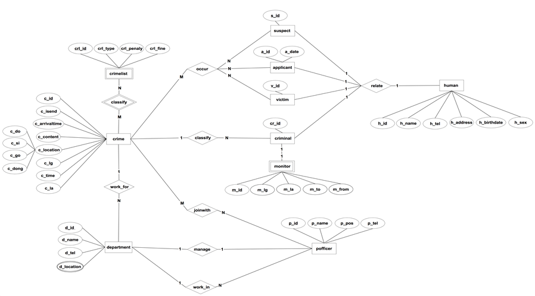
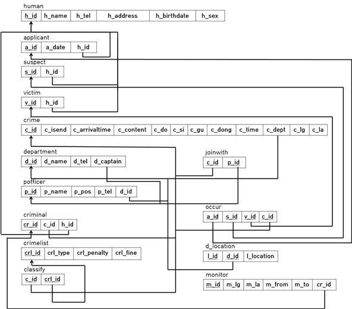

# Crime_Database_System
Crime Statistics System with C#, SQL

## 사용 방법
예시로 만든 데이터 sql은 **data\crimedata.sql**에 있습니다. 
 
**Crime_DB_System Project\WindowsFormsApplication2\From1.cs** 에서 19줄의 **connStr**로 데이터 저장위치를 명시해줍니다. 
ex) 서버: **localhost**, DB 이름: **crimedata**, ID = **root**, PW = **admin** 
private String connStr = "Server=**localhost**;Database=**crimedata**;Uid=**root**;Pwd=**admin**;"; 
 
쿼리 예시는 **\SQL queries Example.hwp**에 있습니다.

## ER Diagram 
 
img\ER_Diagram.png로 크게 확인할 수 있습니다.

## Table
이름 | 설명
---- | ----
Crimelist  | 법에 명시된 범죄 종류와 처벌 정보를 가지고 있음
Crime  | 발생한 사건에 정보를 가지고 있음
department  | 경찰 부서 정보를 가지고 있음
pofficer  | 경찰관 정보를 가지고 있음
Joinwith  | 누가(경찰관) 범죄를 담당하고 있는지
Criminal  | 범죄를 저질러서 형벌을 받는 사람들
monitor  | 일정 기간 동안, 감시를 받아야하는 범죄자 
victim  | 범죄로부터 피해를 당한 사람
applicant  | 사건을 신고한 사람
suspect  | 사건에 혐의를 받는 수사 대상자
human  | 사람 정보를 가지고 있음

## Mapping Table 
 
img\Mapping_Table.png에서 크게 확인할 수 있습니다.
